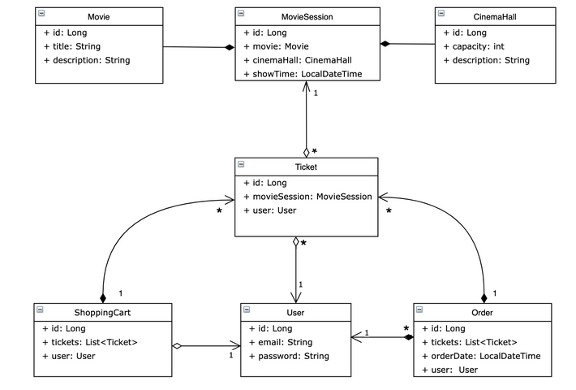

### **Cinema shop Web Application**

This is a web project, which could be characterized as a simple cinema shop realization. The project is based on the principles of SOLID and three-tier software architecture. Besides, such frameworks as Spring Web, Spring REST, Spring Security, Hibernate  have been used to accomplish the cinema shop. Authentication and authorization are also represented as a part of a project. HTTP requests can be sent in JSON format and are stored in a database.

Completed structure of project is described below

### **Features provided by the application for registered users**

    You are given the following endpoints:

    POST: /register - all 
    GET: /cinema-halls - user/admin 
    POST: /cinema-halls - admin 
    GET: /movies - user/admin 
    POST: /movies - admin 
    GET: /movie-sessions/available - user/admin 
    GET: /movie-sessions/{id} - user/admin 
    POST: /movie-sessions - admin 
    PUT: /movie-sessions/{id} - admin 
    DELETE: /movie-sessions/{id} - admin 
    GET: /orders - user 
    POST: /orders/complete - user 
    PUT: /shopping-carts/movie-sessions - user 
    GET: /shopping-carts/by-user - user 
    GET: /users/by-email - admin 

### **Technologies**
1. Java 11
2. Maven
3. MySQL
4. Hibernate
5. Javax servlet API
6. Spring (REST, Web, Security)
7. Tomcat 9.0.50 (to run app locally)

### **How to run this application**
1. Install MySQL
2. Install Tomcat 9.0.50 version. Link -> [https://tomcat.apache.org/download-90.cgi]
(https://tomcat.apache.org/download-90.cgi)
3. Fork this project to your repository
4. Clone it using one of the "Code" options, which is more suitable for you
5. Also, in the file `src/main/resources/db.properties` you should fill correct values in these
     fields
~~~
for example: 
    URL = "jdbc:mysql://localhost:3306/cinema?serverTimezone=UTC";
    USERNAME = "root";
    PASSWORD = "1234";
    JDBC_DRIVER = "com.mysql.cj.jdbc.Driver";
~~~
6. Run this project using Tomcat local server
